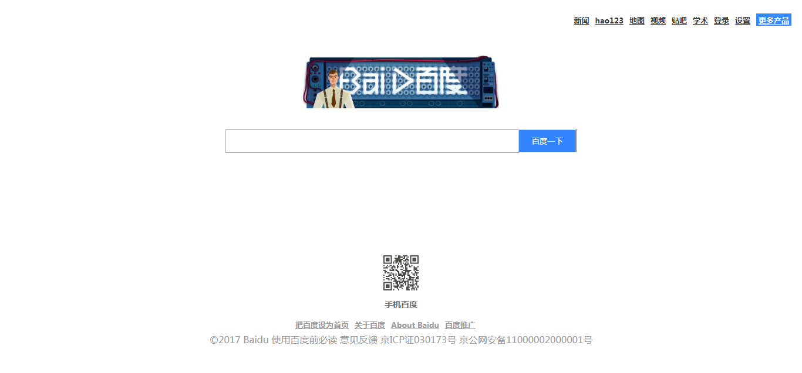

**问题：**
说起前端其实基础的东西就那么多，也不难理解，但是如果想做一个好的页面，还是要做大量的练习，只有通过大量反复的练习，我们才能更加熟悉一些常用标签的使用场景和使用技巧，今天我就给大家提供一个简单的百度首页界面。可以直接复制代码运行。

**效果图如下：**

**代码如下：**

~~~
<html>
<head>
    <title>百度</title>
    
</head>
<body>
    <ul class="f_r">
        <li><a href="javascript:;">新闻</a></li>
        <li><a href="javascript:;">hao123</a></li>
        <li><a href="javascript:;">地图</a></li>
        <li><a href="javascript:;">视频</a></li>
        <li><a href="javascript:;">贴吧</a></li>
        <li><a href="javascript:;">学术</a></li>
        <li><a href="javascript:;">登录</a></li>
        <li><a href="javascript:;">设置</a></li>
        <li class="more_products"><a href="javascript:;">更多产品</a></li>
    </ul>

    

        
    

    

        <form>
            <input type="text" name="keyword">
            <input type="button" value="百度一下">
        </form>
    

    

        

            
            
手机百度

        

        <ul class="friend_link">
            <li><a href="javascript:;">把百度设为首页</a></li>
            <li><a href="javascript:;">关于百度</a></li>
            <li><a href="javascript:;">About Baidu</a></li>
            <li><a href="javascript:;">百度推广</a></li>
        </ul>
        
©2017 Baidu 使用百度前必读 意见反馈 京ICP证030173号  京公网安备11000002000001号 

    

</body>
</html>
~~~

附上git地址：https://github.com/zhongyushi/baidu_index
总结：如果您对我的代码优化有更好的建议，欢迎交流指正。
